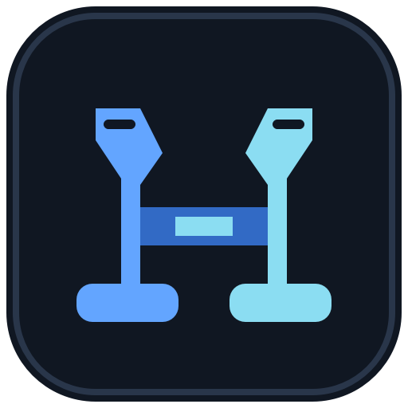

# USB/IP + Joystick Bridge (RemoteHosas)

A Windows desktop application for sharing USB devices between Windows PCs and monitoring local or imported joysticks. **v0.0.1** is the first public testing release. The interface and application messages are in English.



## Download and run

Download **RemoteHosas.exe** from [Releases](https://github.com/EduardoOsquel/remote-hosas/releases). This is a single-file **Windows x64** application: Python, Qt, pygame and icon assets are included. No application installer or Python installation is needed. Launch the EXE normally; it does not open a console. First launch can take a few seconds while bundled files are extracted.

The USB/IP components and their drivers are separate prerequisites. Install the component needed for each PC from **Management**. The application executable is currently unsigned. A SHA-256 checksum accompanies the release for download verification.

## How it works

```text
Physical USB device -> Windows HOST (usbipd-win)
                           |
                      USB/IP TCP 3240
                           |
                       Windows CLIENT (usbip-win2) -> local applications
```

- **Host** is the PC physically connected to the device. Sharing makes it available for a client to attach.
- **Client** imports a shared device so Windows applications can use it. An attached device may become unavailable to applications on the host until detached.
- A PC may have both roles, but only install the components you need. This workflow does not use WSL.
- USB/IP performs the forwarding. The Joystick tab is a local monitor, not a separate joystick network protocol.

Use supported Windows versions for the upstream drivers. The included executable targets x64; the source installer helper also recognizes ARM64 assets, but this release does not include an ARM64 application build. Device and driver compatibility must be tested with your hardware.

## First connection: two Windows PCs

### 1. Prepare the host

1. Connect the physical USB device.
2. Open **Management** and install **usbipd-win** if it is not detected. This installation uses Windows Package Manager (`winget`).
3. Open **Host Mode**, click **List devices**, and select the device by its name and BUSID.
4. Click **Bind / Share** and approve the administrator prompt. The table refreshes automatically; **Shared** appears in green.
5. Identify the host address reachable from your client, for example its Ethernet IPv4 address.

### 2. Prepare the client

1. Open **Management** and install **usbip-win2** if needed. Read the driver and restore-point explanation before continuing.
2. Open **Client Mode**, enter the **host PC address** and leave the server TCP port at **3240** for a standard usbipd-win setup.
3. Click **List remote devices**, select the shared device, then **Attach / Connect**.
4. Check the imported-device list and open the Windows application that will use the device.

**Use this PC** selects `127.0.0.1` for local testing; it does not locate another computer. Changing the host or port clears the previous remote selection. The virtual hub port shown for imported devices is assigned by the client driver and is different from TCP 3240.

### 3. Finish a session

Use **Detach / Disconnect** for one imported device or **Detach all** for all imports on the client, including imports from other hosts. Detach all is enabled only when connections are detected.

**Exit application** checks the current imports, disconnects them and verifies cleanup before exiting. A progress dialog allows cancelling exit; errors keep the application open. Cancelling does not reconnect devices already detached. **Host shares remain shared** after exit; use **Unbind / Stop sharing** if you want to stop sharing a host device.

## Network setup and troubleshooting

Both PCs need a reachable network path. Ethernet and Wi-Fi can work together if the router permits traffic between them. Guest Wi-Fi, client isolation, different subnets without routing, or the wrong network-adapter address can prevent access.

The host must allow inbound **TCP 3240** and have its USB/IP service running. The application does not configure firewall rules. Test from the client with:

```powershell
Test-NetConnection HOST_IP -Port 3240
```

If `TcpTestSucceeded` is false, resolve the address, routing, service or firewall issue before retrying. A custom TCP port in Client Mode does not change the server's listening port.

A reachable Tailscale address can be entered as the host address when both PCs are configured appropriately. Tailscale installation, access policies and routing are outside this application. Prefer a trusted LAN or protected VPN; do not expose USB/IP directly to the public Internet.

For errors, open **Management > Export diagnostics**. The export includes command results and original external-tool output, which may contain device names and network addresses. Review it before publishing it. External tool messages, Windows dialogs and device names may use the operating system language even though the application UI is English.

## Features by tab

### Host Mode

- Detects local USB devices and existing share states at startup.
- Keeps selection and table layout stable after refresh; drag the table/log separator to resize the panels.
- Enables Bind and Unbind according to the selected device state.
- Executes commands asynchronously and requests administrator permission for sharing changes when required. Declined elevation is reported.
- Refreshes device states after sharing attempts, including failures.

### Client Mode

- Lists devices exported by the configured host and devices already imported locally.
- Attaches, detaches, and disconnects all imported devices.
- Uses asynchronous commands with time limits and refreshes connections after actions.
- Remembers the host and TCP port between sessions.

### Management

- Detects the real installed executable paths, including supported custom client installation locations.
- Installs/removes usbipd-win through winget and usbip-win2 through its official installer/uninstaller.
- Downloads the latest stable usbip-win2 release from its official GitHub repository, selects the architecture, and checks size, published SHA-256 and Authenticode signature before installation.
- Reports the installed local server version when available. There is no certified version-pair compatibility matrix: selecting the latest stable client is not a guarantee for every server version or device. If no local server exists, the latest stable client is still selected; the server may be on another PC.
- Disables client uninstall when no registered uninstaller is available.
- Offers log clearing, diagnostic export and **About** with version and author details.

**Restore points:** creating a Windows restore point before client driver installation is enabled by default. The helper requests administrator access and verifies creation. If System Protection is unavailable, Windows' creation-frequency limit is reached, or verification fails, installation stops. Proceeding without a new point requires explicit confirmation. The application does not automatically enable System Protection, change its frequency limits, or restart Windows. A restore point is not a backup of personal files.

### Joystick

Refresh controllers, select a local or imported joystick, and start monitoring axes, buttons and hats. Readings refresh every 20 ms. Disconnection stops monitoring and shows **Disconnected** instead of repeatedly logging errors. Refresh and start again after reconnecting. The tab does not implement remapping, virtual controller emulation, or its own network transport.

## System tray and background behavior

Minimizing hides the window in the system tray. Closing the window offers **Send to System Tray**, **Exit application**, or cancel. Sending to the tray keeps active connections. Windows controls whether the icon is in the hidden-icons panel or directly on the taskbar.

Right-click the icon to show the application, open a tab, share/stop sharing a local device, connect/disconnect a device, disconnect all, refresh device lists, view About, or exit. Connect uses the host configured in Client Mode. Menus use the latest known lists; merely opening the menu does not query the remote host.

Windows uses native popup menus with dark appearance where supported, preserving native submenu integration. Device icons are inferred from names (gaming, mouse, keyboard, camera, audio, network); unknown devices use a generic USB icon. High-contrast settings take precedence. Unsupported native styling falls back to the system appearance.

Automatic checks run every 30 seconds and when returning to the window. Unchanged states do not produce interface log entries or make buttons flicker. **Remote automatic queries run only while Client Mode is visible**; Host Mode and the hidden tray continue local checks without contacting a saved remote IP. Manual tray refresh explicitly includes the configured remote host.

Manual actions take priority over background client list queries. Host, Client and Management operations are coordinated to prevent conflicting commands. Read-only background queries can be interrupted; installation and device-changing commands are not interrupted this way. Exit cleanup has an overall deadline and cancellation control.

Preferences are stored per Windows user through QSettings (`RemoteHosas / USBIPBridge`): host, port, window size/maximized state and Host separator position. Saving preferences does not automatically attach or share devices. Diagnostics retain the most recent 100 command records in memory until exit or export.

## Run from source

Developed and packaged with Python 3.12 x64. From the project directory:

```powershell
py -3.12 -m venv .venv
.venv\Scripts\python.exe -m pip install -r requirements-build.txt
.venv\Scripts\python.exe launcher.py
```

`app.py` and the compatibility launcher `usbip_ui.py` also open the application. Running from an existing terminal does not close that terminal.

## Build the single-file executable

```powershell
.venv\Scripts\python.exe -m PyInstaller --noconfirm RemoteHosas.spec
```

Output: `dist/RemoteHosas.exe`. `build.ps1` uses the same specification. The build bundles application assets, uses windowed mode, includes version metadata, and preserves redirected Management helper diagnostics without allocating a console. No application installer is produced.

## Tests

```powershell
.venv\Scripts\python.exe -m pip install pytest
.venv\Scripts\python.exe -B -m pytest -q -p no:cacheprovider
```

Tests cover parsers, command coordination, device state handling, UI workflows, installation verification, restore points, shutdown and native menus. System-changing operations are mocked; tests do not install drivers or create actual restore points. UI tests use Qt's offscreen platform. Real hardware, elevation dialogs, network connectivity and Windows tray appearance still need manual testing.

The packaged `--smoke-test` checks loading Qt, application modules and icons, then exits. It does not perform a USB/IP session.

## Project structure

| Files | Responsibility |
| --- | --- |
| `app.py`, `client_ui.py`, `management_ui.py`, `about_ui.py` | Application window and tabs |
| `usbip_manager.py`, `host_commands.py`, `operation_gate.py` | Discovery, command execution and coordination |
| `usbip_installer.py`, `restore_point.py` | Verified client installation and restore points |
| `system_tray.py`, `native_tray_menu.py`, `native_menu_style.py` | Tray actions and native Windows menus |
| `ui_theme.py`, `ui_icons.py`, `app_icon.py`, `assets/` | Styling, icons and identity |
| `joystick_bridge.py` | Controller state and packet serialization |
| `command_log.py`, `windowed_io.py` | Diagnostics and windowed helper output |
| `launcher.py`, `RemoteHosas.spec`, `version_info.txt` | Executable entry point and packaging |
| `tests/` | Automated regression checks |

## Author and components

Created by **Eduardo Osquel Pérez Rivero**. Contact: [eduardoosquel@hotmail.com](mailto:eduardoosquel@hotmail.com) · [GitHub](https://github.com/EduardoOsquel).

Currently provided at no charge. Future versions may have different availability or licensing terms. No new project license is introduced by this release; third-party components retain their respective licenses.

- [usbipd-win](https://github.com/dorssel/usbipd-win): Windows USB/IP server.
- [usbip-win2](https://github.com/vadimgrn/usbip-win2): Windows USB/IP client and driver; consult its requirements and installation guidance.
- [PyQt6](https://www.riverbankcomputing.com/software/pyqt/): Qt bindings for the interface.
- [pygame](https://www.pygame.org/): controller monitoring.
- [PyInstaller](https://pyinstaller.org/): standalone executable packaging.
